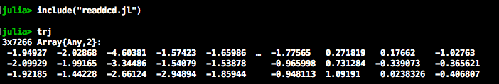
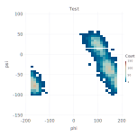

# molecularDynamicsJulia

## What

This repository contains Julia scripts I wrote for running and processing replica exchange molecular dynamics (REMD) runs in 2014. Before this, everything was written in Bash (some of which I've also uploaded in my [Replica Exchange repo](https://github.com/sndean/replica-exchange)).
 
## Why

I wrote these scripts because I thought (and still do think) Julia is a cool language, and because some of them were ~10x faster than the Bash equivalent: specifically the `rest2_11.jl` is ~10x faster than the Bash equivalent. Not particularly dramatic over 1 or a few timesteps, but a significant time-savings over thousands of iterations.

That said, the Bash version in the [Replica Exchange repo](https://github.com/sndean/replica-exchange) is more polished and readable, at least to me.

## Documentation

This is only compatible with NAMD.

I'll add more documentation in the future, but please be aware that these scripts were written when:
 - I barely knew how to program
 - Julia was much young(er) and so may only be compatible with versions circa ~0.2 - 0.3.
 
